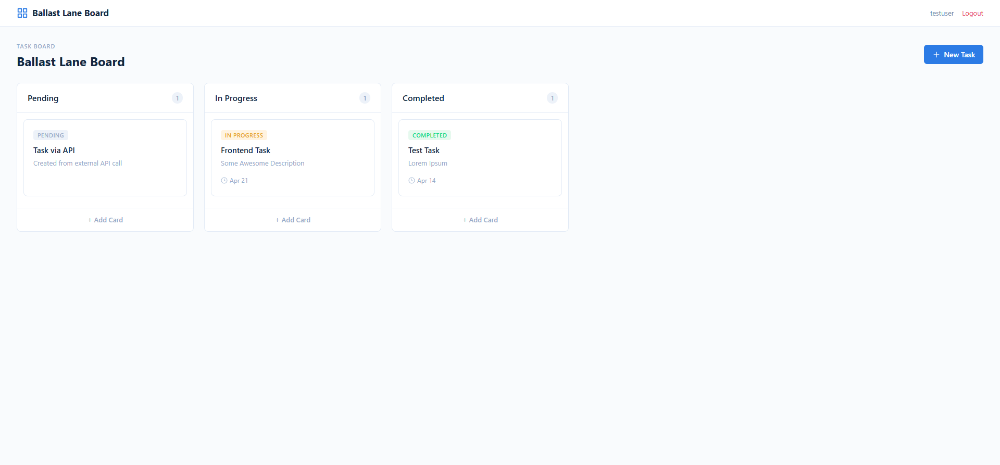
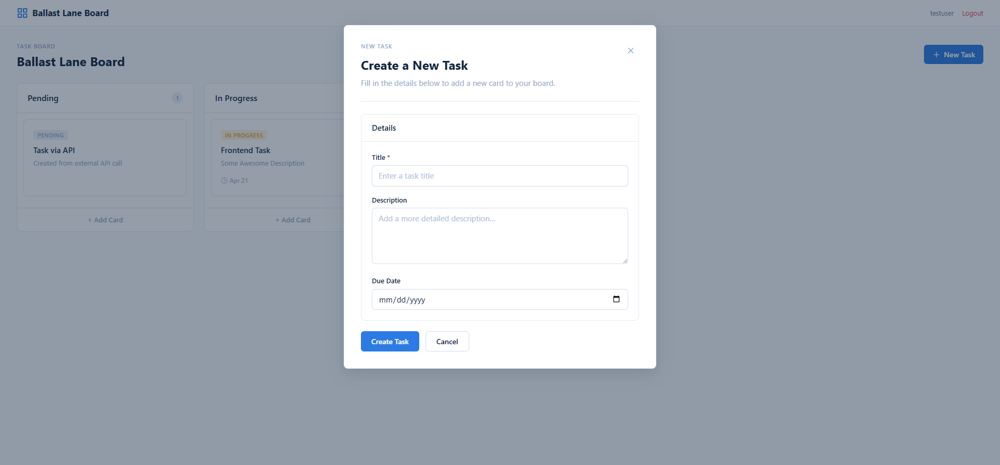
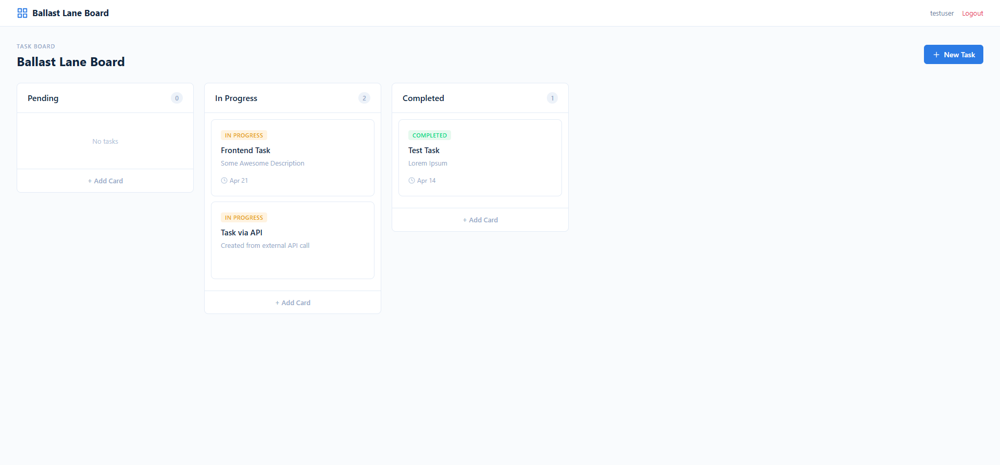
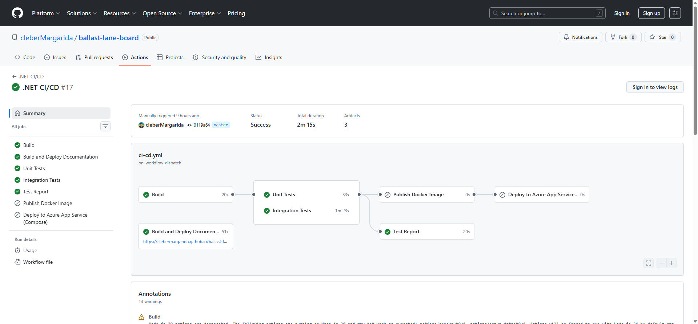

# Ballast Lane Board — Task Management Platform

[](https://github.com/cleberMargarida/ballast-lane-board/actions/workflows/ci-cd.yml)
[](https://hub.docker.com/r/clebermargarida/ballast-lane-board)
[](#license)
[](https://github.com/cleberMargarida/ballast-lane-board/actions/runs/24013117103)


A full-stack task management application built with **Clean Architecture**, **.NET 10**, **Angular 19 + Tailwind CSS 4**, **PostgreSQL**, and **Keycloak OIDC**.

---

## Live Demo

> **[https://ballast-lane-board.azurewebsites.net](https://ballast-lane-board.azurewebsites.net)**

The application is deployed on **Azure App Service** as a multi-container Docker Compose app with **Azure PostgreSQL Flexible Server**. Three services — Nginx reverse proxy, .NET API (serving the Angular SPA), and Keycloak — run behind a single domain.

| | URL |
|---|---|
| **Application** | [ballast-lane-board.azurewebsites.net](https://ballast-lane-board.azurewebsites.net) |
| **Swagger UI** | [ballast-lane-board.azurewebsites.net/api](https://ballast-lane-board.azurewebsites.net/api) |
| **Health Check** | [ballast-lane-board.azurewebsites.net/health](https://ballast-lane-board.azurewebsites.net/health) |

Sign up at [/signup](https://ballast-lane-board.azurewebsites.net/signup) or use the demo credentials below.

---

## Architecture


| Layer | Project | Responsibility |
|---|---|---|
| **Domain** | `BallastLaneBoard.Domain` | Entities, value objects, business rules. Zero dependencies. |
| **Application** | `BallastLaneBoard.Application` | Services, DTOs, repository/UoW interfaces. Depends only on Domain. |
| **Infrastructure** | `BallastLaneBoard.Infra` | Raw ADO.NET (Npgsql), Keycloak Admin client, migration hosting. |
| **WebApi** | `BallastLaneBoard.WebApi` | ASP.NET composition root, controllers, Swagger, SPA middleware. |
| **Client** | `BallastLaneBoard.ClientApp` | Angular 19 SPA with Tailwind CSS, OIDC integration. |

### Key Patterns

- **Result\<T\>** — functional error handling; domain methods return `Result<T>` with `IsSuccess`/`IsFailed`/`Error`
- **DbConnectionUoW** — abstract Npgsql connection + transaction base; one concrete UoW per bounded context
- **IRepository\<T\>** — per-aggregate repository interface backed by raw ADO.NET

---

## Prerequisites

- [.NET 10 SDK](https://dotnet.microsoft.com/download)
- [Node.js 20+](https://nodejs.org/) (for Angular CLI)
- [Docker Desktop](https://www.docker.com/products/docker-desktop)

---

## Quick Start

### 1. Start infrastructure

```bash
docker compose up -d
```

This starts:
- **PostgreSQL 17** on port `5432` (two databases: `keycloak`, `ballastlaneboard`)
- **Keycloak 26.2** on port `8080` with imported realm + custom theme

### 2. Run the API

```bash
dotnet run --project src/BallastLaneBoard.WebApi
```

The API starts at `https://localhost:7160` / `http://localhost:5293`. EF Core migrations run automatically on startup.

In local development the Web API now serves the SPA from `src/BallastLaneBoard.WebApi/wwwroot` by default so F5/debug runs follow the same path as production. If you want Angular hot reload instead, set `Spa:UseProxyInDevelopment=true` in the Web API configuration and start the Angular dev server.

### 3. Run the Angular client

```bash
cd src/BallastLaneBoard.ClientApp
npm install
npm start
```

Angular dev server runs at `http://localhost:4200`, proxying API calls to the backend when `Spa:UseProxyInDevelopment=true`.

If you want local debug to keep serving static assets from the Web API like production, build and sync the Angular bundle into `wwwroot`:

```bash
cd src/BallastLaneBoard.ClientApp
npm run build:webapi
```

---

## Demo Credentials

| User | Password | Role | Notes |
|---|---|---|---|
| `admin` | `admin` | Admin + User | Can see/manage all tasks |
| `testuser` | `password` | User | Regular user, own tasks only |

Sign in via Keycloak at `http://localhost:8080/realms/ballast-lane-board/account`.

---

## API Endpoints

| Method | Path | Auth | Description |
|---|---|---|---|
| `GET` | `/api/tasks` | Bearer | List tasks (admins see all, users see own) |
| `GET` | `/api/tasks/{id}` | Bearer | Get task by ID |
| `POST` | `/api/tasks` | Bearer | Create task |
| `PUT` | `/api/tasks/{id}` | Bearer | Update task |
| `PATCH` | `/api/tasks/{id}/status` | Bearer | Change task status |
| `DELETE` | `/api/tasks/{id}` | Bearer | Delete task |
| `POST` | `/api/auth/register` | Public | Register user via Keycloak |
| `GET` | `/api/auth/me` | Bearer | Current user profile |
| `POST` | `/api/auth/sync` | Bearer | Sync last-seen timestamp |
| `GET` | `/health` | Public | Health check |

**Swagger UI**: `http://localhost:5293/api` (dark theme, bearer token support)

---

## Testing

```bash
# Unit tests (fast, no containers)
dotnet test tests/BallastLaneBoard.Domain.UnitTests
dotnet test tests/BallastLaneBoard.Application.UnitTests

# Integration tests (requires Docker for Testcontainers)
dotnet test tests/BallastLaneBoard.Infra.IntegrationTests
dotnet test tests/BallastLaneBoard.WebApi.IntegrationTests

# All tests
dotnet test
```

### Test Strategy

| Project | Scope | Dependencies |
|---|---|---|
| `Domain.UnitTests` | Entity invariants, factory methods, status transitions | None (pure domain) |
| `Application.UnitTests` | Service logic, CRUD flows, authorization | In-memory UoW doubles |
| `Infra.IntegrationTests` | EF schema, seeds, repository behavior | Testcontainers PostgreSQL |
| `WebApi.IntegrationTests` | Full endpoint coverage, auth/ownership | WebApplicationFactory + Testcontainers |

---

## Project Structure

```
ballast-lane-board/
├── docker-compose.yml
├── keycloak/
│   ├── ballast-lane-board-realm.json
│   └── themes/ballast-lane-board/login/
├── src/
│   ├── BallastLaneBoard.Domain/
│   │   ├── Core/          (Result, IEntity)
│   │   ├── TaskManagement/ (TaskItem, TaskError, TaskItemStatus)
│   │   └── Identity/       (AppUser, UserError, UserRole)
│   ├── BallastLaneBoard.Application/
│   │   ├── Abstractions/   (IUnitOfWork, IRepository)
│   │   ├── TaskManagement/ (TaskService, ITaskUoW, Models)
│   │   └── Identity/       (UserService, IUserUoW, Models)
│   ├── BallastLaneBoard.Infra/
│   │   ├── Data/           (DbConnectionUoW, TaskRepository, UserRepository, TaskUoW, UserUoW)
│   │   └── Keycloak/       (KeycloakAdminClient)
│   ├── BallastLaneBoard.WebApi/
│   │   ├── Controllers/    (Tasks, Auth, Health)
│   │   └── wwwroot/        (swagger-dark.css)
│   └── BallastLaneBoard.ClientApp/
│       └── src/app/        (Angular 19 + Tailwind CSS 4)
└── tests/
    ├── BallastLaneBoard.Domain.UnitTests/
    ├── BallastLaneBoard.Application.UnitTests/
    ├── BallastLaneBoard.Infra.IntegrationTests/
    └── BallastLaneBoard.WebApi.IntegrationTests/
```

---

## Build

```bash
dotnet build
```

---

## CI/CD (GitHub Actions)

Workflow file: `.github/workflows/ci-cd.yml`

### Pipeline triggers

- Push: `master`, `develop`
- Pull request: all branches
- Release published: image publish + Azure deploy
- Manual dispatch (`workflow_dispatch`): documentation build + GitHub Pages deploy

### Required GitHub Secrets

- `DOCKERHUB_USERNAME`
- `DOCKERHUB_TOKEN`
- `AZURE_CREDENTIALS` (Service Principal JSON for `azure/login`)
- `AZURE_RESOURCE_GROUP`
- `AZURE_WEBAPP_NAME`

### Runtime app settings for Azure App Service

Set these in the App Service configuration so the container can start correctly:

- `ConnectionStrings__DefaultConnection`
- `OpenIdConnect__Authority`
- `OpenIdConnect__PublicAuthority`
- `OpenIdConnect__Audience`
- `OpenIdConnect__RoleClaimPath`
- `OpenIdConnect__RequireHttpsMetadata`
- `IdentityProvider__AdminUrl`
- `IdentityProvider__Realm`
- `IdentityProvider__AdminUser`
- `IdentityProvider__AdminPassword`

The deploy job uses `.github/azure/docker-compose.appservice.yml` as the App Service multi-container source and injects the released API image tag automatically.

---

## Screenshots

| Sign In | Board | Create Task | Status Change |
|---------|-------|-------------|---------------|
|  |  |  |  |



---

## License

No license file is currently committed in this repository. Until one is added, treat the codebase as unlicensed / all rights reserved.
