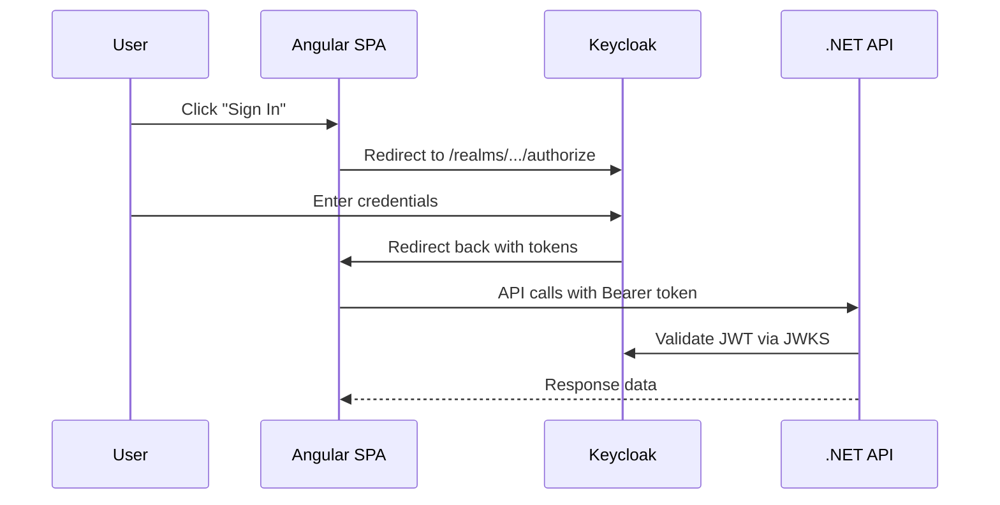

# Authentication API

## Overview

Ballast Lane Board uses **Keycloak OpenID Connect (OIDC)** for authentication. Users **do not log in via the API** — instead, the Angular SPA redirects to Keycloak's login page, which returns JWT tokens upon successful authentication.

The API provides endpoints for **user registration**, **profile retrieval**, and **last-seen synchronization**.

---

## OIDC Flow



> [!NOTE]
> The Keycloak realm `ballast-lane-board` is auto-imported on first startup from `keycloak/ballast-lane-board-realm.json`.

---

## Endpoints

| Method | Path | Auth | Description |
|---|---|---|---|
| `POST` | `/api/auth/register` | Public | Register a new user |
| `GET` | `/api/auth/me` | Bearer | Get current user profile |
| `POST` | `/api/auth/sync` | Bearer | Sync last-seen timestamp |

---

## POST /api/auth/register

Creates a new user in **Keycloak** and **mirrors locally** as an `AppUser`. This is the only public (unauthenticated) endpoint in the auth API.

**Request:**

```json
{
  "username": "newuser",
  "email": "newuser@example.com",
  "password": "securePassword123"
}
```

| Field | Type | Required | Notes |
|---|---|---|---|
| `username` | string | ✅ | Must not be empty |
| `email` | string | ✅ | Must contain `@` |
| `password` | string | ✅ | Sent to Keycloak for credential setup |

**Response (201 Created):**

```json
{
  "id": "a1b2c3d4-0000-0000-0000-000000000002",
  "username": "newuser",
  "email": "newuser@example.com",
  "role": "User",
  "createdAt": "2026-04-05T12:00:00Z",
  "lastSeenAt": "2026-04-05T12:00:00Z"
}
```

**Error (400 Bad Request):**

```json
"UsernameRequired"
```

**Flow:**
1. `KeycloakAdminClient.CreateUserAsync()` creates the user in Keycloak (Admin REST API)
2. `AppUser.Create()` creates a local mirror with the Keycloak subject ID
3. `UserUoW.Commit()` persists the local record

---

## GET /api/auth/me

Returns the authenticated user's profile. The user is identified by their JWT `sub` claim (Keycloak subject).

**Response (200 OK):**

```json
{
  "id": "a1b2c3d4-0000-0000-0000-000000000001",
  "username": "admin",
  "email": "admin@ballastlaneboard.com",
  "role": "Admin",
  "createdAt": "2026-01-01T00:00:00Z",
  "lastSeenAt": "2026-04-05T15:30:00Z"
}
```

**Error:** `404 Not Found` if the user's subject is not in the local database.

---

## POST /api/auth/sync

Updates the authenticated user's `LastSeenAt` timestamp. Called by the SPA on login or periodic activity.

**Response (200 OK):**

```json
{
  "id": "a1b2c3d4-0000-0000-0000-000000000001",
  "username": "admin",
  "email": "admin@ballastlaneboard.com",
  "role": "Admin",
  "createdAt": "2026-01-01T00:00:00Z",
  "lastSeenAt": "2026-04-05T16:00:00Z"
}
```

**Error:** `404 Not Found` if the user's subject is not in the local database.

---

## UserResponse Schema

```json
{
  "id": "guid",
  "username": "string",
  "email": "string",
  "role": "User | Admin",
  "createdAt": "DateTimeOffset",
  "lastSeenAt": "DateTimeOffset"
}
```

---

## Demo Credentials

| User | Password | Role | Notes |
|---|---|---|---|
| `admin` | `admin` | Admin + User | Sees all tasks, full management |
| `testuser` | `password` | User | Sees own tasks only |

These users are seeded via the Keycloak realm import (`keycloak/ballast-lane-board-realm.json`) and mirrored locally on first API startup.
