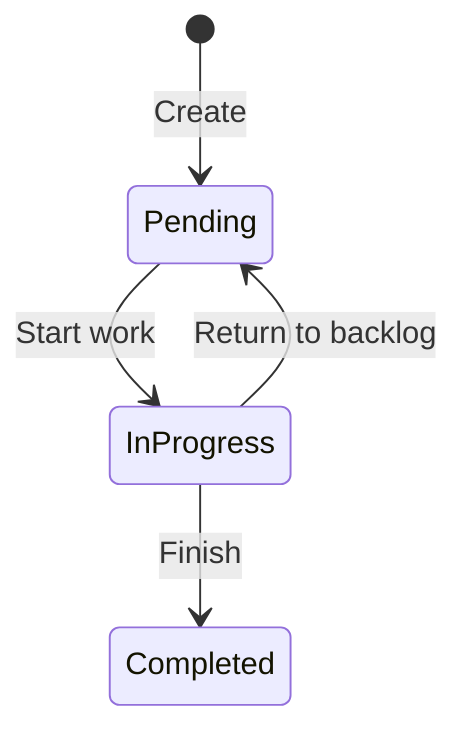

# Tasks API

All task endpoints require authentication via a **Bearer JWT token**. Admins can view all tasks; regular users can only view and manage their own.

---

## Endpoints

| Method | Path | Description | Success Code |
|---|---|---|---|
| `GET` | `/api/tasks` | List tasks (admins: all, users: own) | 200 |
| `GET` | `/api/tasks/{taskId}` | Get task by ID | 200 |
| `POST` | `/api/tasks` | Create a new task | 201 |
| `PUT` | `/api/tasks/{taskId}` | Update task details | 200 |
| `PATCH` | `/api/tasks/{taskId}/status` | Change task status | 204 |
| `DELETE` | `/api/tasks/{taskId}` | Delete a task | 204 |

---

## Response Codes

| Code | Meaning |
|---|---|
| `200 OK` | Successful retrieval or update |
| `201 Created` | Task created successfully (includes `Location` header) |
| `204 No Content` | Successful status change or deletion |
| `400 Bad Request` | Validation error (missing title, invalid due date, invalid status transition) |
| `401 Unauthorized` | Missing or invalid Bearer token |
| `403 Forbidden` | User does not own the task (non-admin) |
| `404 Not Found` | Task does not exist |

---

## Task Status State Machine



Only the task **owner** can change status. Invalid transitions return `400 Bad Request`.

---

## Endpoint Details

### GET /api/tasks

List all tasks for the authenticated user. Admins see all tasks across all users.

**Response:**

```json
[
  {
    "id": "3fa85f64-5717-4562-b3fc-2c963f66afa6",
    "title": "Implement login page",
    "description": "Build the Keycloak OIDC login flow",
    "status": "InProgress",
    "dueDate": "2026-06-15T00:00:00Z",
    "userId": "a1b2c3d4-0000-0000-0000-000000000001",
    "createdAt": "2026-04-01T10:00:00Z",
    "updatedAt": "2026-04-03T14:30:00Z"
  }
]
```

---

### GET /api/tasks/{taskId}

Get a specific task by ID. Returns `403 Forbidden` if the user does not own the task (and is not an admin).

**Response:** Single `TaskResponse` object (same shape as list items).

---

### POST /api/tasks

Create a new task assigned to the authenticated user.

**Request:**

```json
{
  "title": "Design landing page",
  "description": "Create mockups for the main landing page",
  "dueDate": "2026-07-01T00:00:00Z"
}
```

| Field | Type | Required | Notes |
|---|---|---|---|
| `title` | string | ✅ | Cannot be empty or whitespace |
| `description` | string | ❌ | Optional |
| `dueDate` | DateTimeOffset | ❌ | Must be in the future if provided |

**Response:** `201 Created` with `Location` header pointing to the new task.

```json
{
  "id": "3fa85f64-5717-4562-b3fc-2c963f66afa6",
  "title": "Design landing page",
  "description": "Create mockups for the main landing page",
  "status": "Pending",
  "dueDate": "2026-07-01T00:00:00Z",
  "userId": "a1b2c3d4-0000-0000-0000-000000000001",
  "createdAt": "2026-04-05T12:00:00Z",
  "updatedAt": "2026-04-05T12:00:00Z"
}
```

---

### PUT /api/tasks/{taskId}

Update task details. Only the task owner can update.

**Request:**

```json
{
  "title": "Design landing page (v2)",
  "description": "Updated mockups with new branding",
  "dueDate": "2026-08-01T00:00:00Z"
}
```

| Field | Type | Required | Notes |
|---|---|---|---|
| `title` | string | ✅ | Cannot be empty or whitespace |
| `description` | string | ❌ | Optional |
| `dueDate` | DateTimeOffset | ❌ | Must be in the future if provided |

**Response:** `200 OK` with updated `TaskResponse`.

---

### PATCH /api/tasks/{taskId}/status

Change the status of a task. Only the task owner can change status. Valid transitions:

- `Pending` → `InProgress`
- `InProgress` → `Completed`
- `InProgress` → `Pending`

**Request:**

```json
{
  "status": "InProgress"
}
```

| Field | Type | Required | Values |
|---|---|---|---|
| `status` | TaskItemStatus | ✅ | `Pending`, `InProgress`, `Completed` |

**Response:** `204 No Content` on success. `400 Bad Request` for invalid transitions.

---

### DELETE /api/tasks/{taskId}

Delete a task. Only the task owner can delete.

**Response:** `204 No Content` on success.

---

## Authorization Notes

- **All endpoints** require a valid Bearer JWT token issued by Keycloak
- **Admin users** (role: `admin`) can view all tasks via `GET /api/tasks` and `GET /api/tasks/{id}`
- **Regular users** see only their own tasks
- **Mutations** (create, update, status change, delete) are always scoped to the task owner — even admins cannot modify another user's tasks
- Ownership is enforced in both the Application service (`TaskService`) and the Domain entity (`TaskItem`)

---

## Schemas

### TaskResponse

```json
{
  "id": "guid",
  "title": "string",
  "description": "string | null",
  "status": "Pending | InProgress | Completed",
  "dueDate": "DateTimeOffset | null",
  "userId": "guid",
  "createdAt": "DateTimeOffset",
  "updatedAt": "DateTimeOffset"
}
```

### CreateTaskRequest

```json
{
  "title": "string (required)",
  "description": "string (optional)",
  "dueDate": "DateTimeOffset (optional, must be future)"
}
```

### UpdateTaskRequest

```json
{
  "title": "string (required)",
  "description": "string (optional)",
  "dueDate": "DateTimeOffset (optional, must be future)"
}
```

### ChangeTaskStatusRequest

```json
{
  "status": "Pending | InProgress | Completed"
}
```
