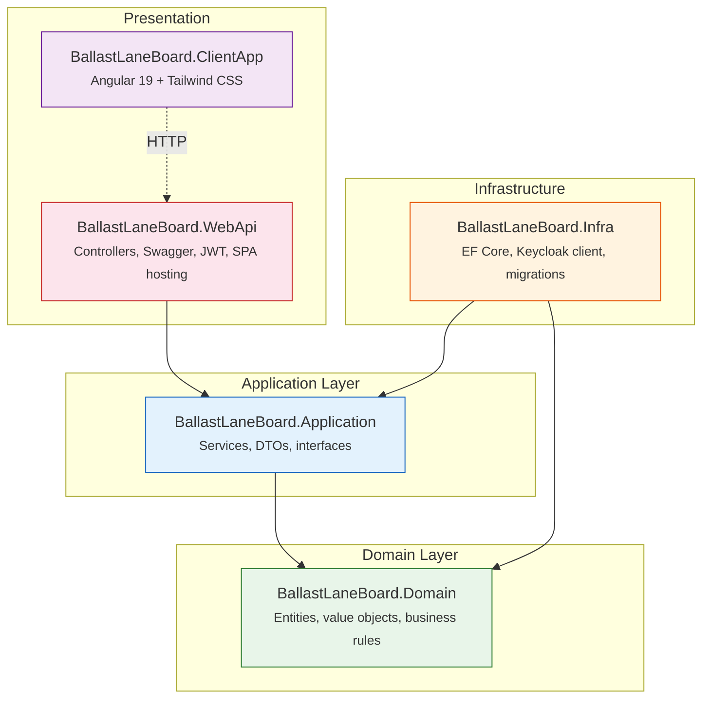
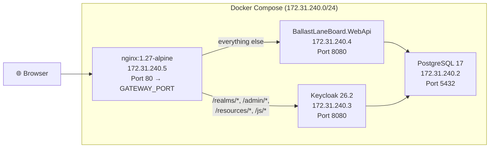
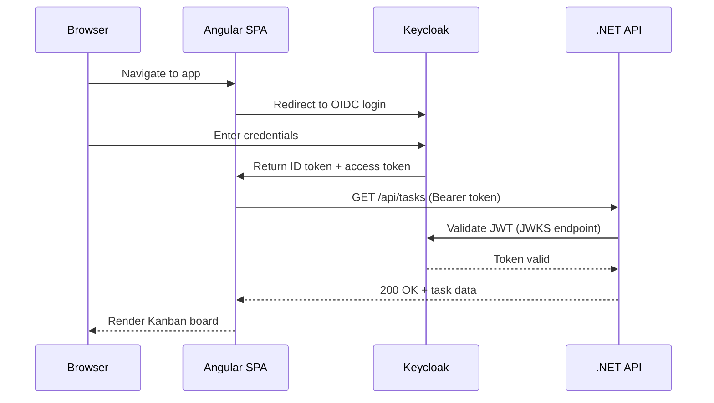
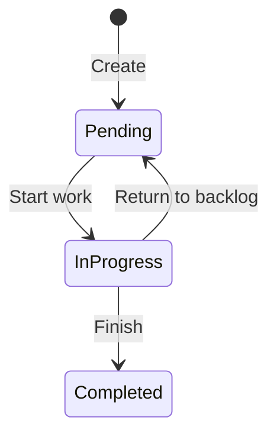
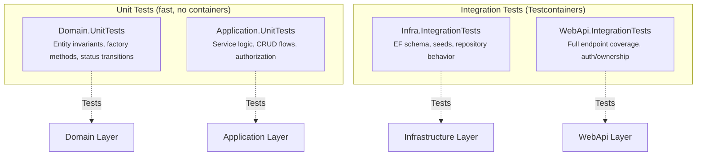

# Architecture Overview

Ballast Lane Board follows **Clean Architecture** principles, organizing code into four .NET projects with strict dependency boundaries plus an Angular SPA client.

---

## Layered Architecture



Dependencies point **inward** — Domain has zero external dependencies, Application depends only on Domain, and Infrastructure implements the interfaces defined by Application. The WebApi layer is the composition root that wires everything together.

---

## Layer Responsibilities

### Domain (`BallastLaneBoard.Domain`)

The innermost layer containing pure business logic with **zero external dependencies**.

- **Entities**: `TaskItem` (aggregate root), `AppUser` (aggregate root)
- **Value Objects**: `TaskItemStatus`, `UserRole`
- **Core**: `Result<T>`, `IEntity`, `IAggregateRoot`, `ICreated<TEntity, TEvent>`
- **Domain Errors**: `TaskError`, `UserError`
- **Domain Events**: `TaskEvent`, `UserEvent`

### Application (`BallastLaneBoard.Application`)

Orchestration layer defining use cases. Depends **only on Domain**.

- **Services**: `TaskService`, `UserService`
- **Interfaces**: `ITaskUoW`, `IUserUoW`, `IRepository<T>`, `IProducer<T>`, `IIdentityProviderClient`
- **Models**: `CreateTaskRequest`, `UpdateTaskRequest`, `TaskResponse`, `RegisterRequest`, `UserResponse`

### Infrastructure (`BallastLaneBoard.Infra`)

Implements Application interfaces with concrete technologies.

- **EF Core**: `DbContextUow<TEntity, TEvent>`, `EFRepository<T>`, `TaskUoW`, `UserUoW`
- **Keycloak**: `KeycloakAdminClient` (implements `IIdentityProviderClient`)
- **Migrations**: `DatabaseMigrationHostedService` (auto-applies pending migrations on startup)

### WebApi (`BallastLaneBoard.WebApi`)

ASP.NET composition root — HTTP layer and dependency injection.

- **Controllers**: `TasksController`, `AuthController`
- **Auth**: JWT Bearer configuration, `UserContextExtensions`
- **OpenAPI**: Swagger with dark theme and Bearer token support
- **SPA Hosting**: Serves Angular app from `wwwroot/` in production

### ClientApp (`BallastLaneBoard.ClientApp`)

Angular 19 SPA with Tailwind CSS 4.

- Kanban board UI with task columns (Pending, In Progress, Completed)
- OIDC integration via `angular-auth-oidc-client`
- Service-based state management with RxJS

---

## Bounded Contexts

### TaskManagement

Handles task lifecycle — creation, updates, status transitions, deletion.

| Component | Description |
|---|---|
| `TaskItem` | Aggregate root with status workflow and ownership |
| `TaskItemStatus` | Enum: Pending, InProgress, Completed |
| `TaskService` | Orchestrates CRUD, enforces ownership |
| `ITaskUoW` | Unit of work interface for task persistence |
| `TaskUoW` | EF Core implementation |

### Identity

Manages user mirroring between Keycloak and the local database.

| Component | Description |
|---|---|
| `AppUser` | Aggregate root mirrored from Keycloak |
| `UserRole` | Enum: User, Admin |
| `UserService` | Orchestrates registration, profile lookup, sync |
| `IUserUoW` | Unit of work interface for user persistence |
| `KeycloakAdminClient` | Creates users in Keycloak via Admin REST API |

---

## Key Patterns

### Result\<T\> — Railway-Oriented Error Handling

Domain methods return `Result<T>` instead of throwing exceptions. Every operation produces either a success value or a typed error:

```csharp
var result = TaskItem.Create(title, description, dueDate, userId);
if (result.IsFailed)
    return Result.Fail<TaskResponse>(result.Error!.Value);
```

### DbContextUow — Unit of Work per Bounded Context

Each bounded context has its own `DbContext`-based unit of work. `DbContextUow<TEntity, TDomainEvent>` is the abstract base that combines EF Core's `DbContext` with `IUnitOfWork`, providing `Commit()` semantics.

### EFRepository\<T\> — Queryable Repository

`EFRepository<T>` wraps `DbSet<T>` behind `IRepository<T> : IQueryable<T>`. This allows LINQ queries in Application services while keeping persistence details in Infrastructure.

### IProducer\<T\> — Domain Event Collection

Domain events are collected within the UoW boundary via `IProducer<T>`. Events are produced alongside entity changes and committed atomically.

### ICreated\<TEntity, TEvent\> — Factory Method Return Type

Aggregate factory methods return `ICreated<TEntity, TEvent>`, pairing the new entity with its creation event in a single return value.

### Identity Mirroring

Keycloak is the source of truth for authentication. When a user registers, `KeycloakAdminClient` creates the user in Keycloak, and `UserService` mirrors the user locally as an `AppUser`. The `ExternalSubject` field links the local record to the Keycloak user ID.

---

## Deployment Architecture



---

## Authentication Flow



---

## Task Status State Machine



Valid transitions are enforced in the `TaskItem.ChangeStatus()` domain method. Only the task owner can change status.

---

## Project Structure

```
ballast-lane-board/
├── docker-compose.yml
├── nginx/nginx.conf
├── keycloak/
│   ├── ballast-lane-board-realm.json
│   └── themes/ballast-lane-board/login/
├── src/
│   ├── BallastLaneBoard.Domain/
│   │   ├── Core/            (Result, IEntity, IAggregateRoot, ICreated)
│   │   ├── TaskManagement/  (TaskItem, TaskItemStatus, TaskEvent, TaskError)
│   │   └── Identity/        (AppUser, UserRole, UserEvent, UserError)
│   ├── BallastLaneBoard.Application/
│   │   ├── Abstractions/    (IUnitOfWork, IRepository, IProducer)
│   │   ├── TaskManagement/  (TaskService, ITaskUoW, Models/)
│   │   └── Identity/        (UserService, IUserUoW, IIdentityProviderClient, Models/)
│   ├── BallastLaneBoard.Infra/
│   │   ├── EntityFrameworkCore/  (DbContextUow, EFRepository, TaskUoW, UserUoW)
│   │   ├── Keycloak/             (KeycloakAdminClient)
│   │   └── DatabaseMigrationHostedService.cs
│   ├── BallastLaneBoard.WebApi/
│   │   ├── Controllers/  (TasksController, AuthController)
│   │   ├── Program.cs    (composition root)
│   │   └── wwwroot/      (Angular SPA build output)
│   └── BallastLaneBoard.ClientApp/
│       └── src/app/       (Angular 19 + Tailwind CSS 4)
└── tests/
    ├── BallastLaneBoard.Domain.UnitTests/
    ├── BallastLaneBoard.Application.UnitTests/
    ├── BallastLaneBoard.Infra.IntegrationTests/
    └── BallastLaneBoard.WebApi.IntegrationTests/
```

---

## Key Design Decisions

| Decision | Why |
|---|---|
| **Clean Architecture (4 layers)** | Enforces separation of concerns; Domain is testable without any framework dependencies |
| **EF Core (despite spec constraint)** | Type-safe LINQ queries, automatic migrations, Testcontainers support. Fully abstracted behind `IRepository<T>` / `IUnitOfWork` — swappable without touching Application or Domain layers |
| **Keycloak OIDC** | Enterprise-grade auth: social login ready, multi-tenant capable, audit logging, RBAC — far beyond basic username/password |
| **Result\<T\> pattern** | Explicit, typed error handling without exceptions for business rule violations. Makes failure paths visible and composable |
| **One UoW per bounded context** | Separate `TaskUoW` and `UserUoW` prevent coupling between contexts and allow independent schema evolution |
| **Identity Mirroring** | Keycloak owns auth, but the API needs local user records for foreign keys and queries. `AppUser` mirrors essential data |
| **Angular 19 + Tailwind CSS** | Modern SPA framework with utility-first CSS; built for production in `wwwroot/` |
| **Docker Compose with static IPs** | Reproducible deployments with predictable networking; no service discovery complexity |

---

## Testing Strategy



| Project | Scope | Dependencies |
|---|---|---|
| `Domain.UnitTests` | Entity invariants, factory methods, status transitions | None (pure domain) |
| `Application.UnitTests` | Service logic, CRUD flows, authorization | In-memory UoW doubles |
| `Infra.IntegrationTests` | EF schema, seeds, repository behavior | Testcontainers PostgreSQL |
| `WebApi.IntegrationTests` | Full endpoint coverage, auth/ownership | WebApplicationFactory + Testcontainers |
