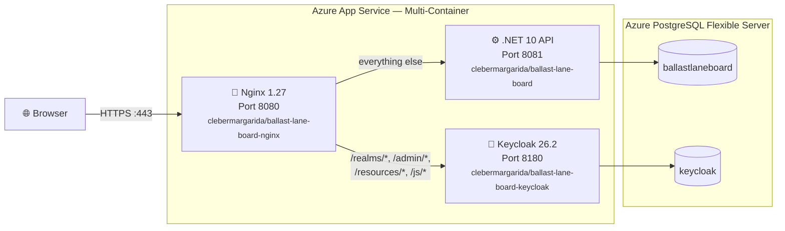
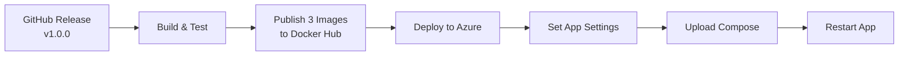

# Azure App Service Deployment

## Overview

Ballast Lane Board runs on **Azure App Service** (Linux, B1) as a multi-container Docker Compose application. Three custom Docker images are published to Docker Hub and orchestrated by the App Service runtime. Data is persisted in **Azure Database for PostgreSQL Flexible Server**.

> [!TIP]
> The live application is available at **[https://ballast-lane-board.azurewebsites.net](https://ballast-lane-board.azurewebsites.net)**.

---

## Architecture



---

## Infrastructure

| Resource | SKU / Tier | Region | Purpose |
|---|---|---|---|
| **App Service Plan** | Linux B1 (1 core, 1.75 GB) | West US 2 | Hosts the multi-container app |
| **Web App** | `ballast-lane-board` | West US 2 | Multi-container Docker Compose |
| **PostgreSQL Flexible Server** | Standard_B1ms (Burstable) | West US 2 | Two databases: `ballastlaneboard` + `keycloak` |

Estimated cost: **~$25–30/month** (B1 App Service ≈ $13 + B1ms PostgreSQL ≈ $12–15).

---

## Docker Images

Three custom images are built and pushed to Docker Hub on every release:

| Image | Base | Purpose |
|---|---|---|
| `clebermargarida/ballast-lane-board` | `mcr.microsoft.com/dotnet/aspnet:10.0` | .NET 10 Web API serving the Angular SPA from `wwwroot` |
| `clebermargarida/ballast-lane-board-keycloak` | `quay.io/keycloak/keycloak:26.2` | Pre-built optimized Keycloak with imported realm + custom theme |
| `clebermargarida/ballast-lane-board-nginx` | `nginx:1.27-alpine` | Reverse proxy routing traffic to API and Keycloak |

### Keycloak Image Optimizations

The Keycloak Dockerfile applies production optimizations that reduce startup from minutes to seconds:

```dockerfile
FROM quay.io/keycloak/keycloak:26.2
COPY ballast-lane-board-realm.json /opt/keycloak/data/import/
COPY themes/ /opt/keycloak/themes/
ENV KC_DB=postgres
ENV KC_CACHE=local           # Single-node cache (no Infinispan cluster)
RUN /opt/keycloak/bin/kc.sh build   # Pre-build at image time
CMD ["start", "--optimized", "--import-realm"]
```

Key decisions:

- **`KC_CACHE=local`** — Disables Infinispan clustering. Single-instance App Service does not need distributed cache.
- **`kc.sh build` at image time** — Pre-compiles providers and themes so `--optimized` skips the build phase on every start.
- **`--import-realm`** — Automatically imports the realm JSON on first database initialization.

### Nginx Routing

Nginx listens on port 8080 (the `WEBSITES_PORT` for App Service) and routes by URL pattern:

| Pattern | Destination | Purpose |
|---|---|---|
| `/realms/*`, `/admin/*`, `/resources/*`, `/js/*` | `keycloak:8180` | Keycloak OIDC endpoints, admin console, static assets |
| Everything else | `api:8081` | .NET Web API + Angular SPA |

The Nginx config forwards `X-Forwarded-*` headers so both the API and Keycloak see the correct external hostname (`https://ballast-lane-board.azurewebsites.net`).

---

## Compose Template

The file `.github/azure/docker-compose.appservice.yml` uses a `__TAG__` placeholder that is replaced at deploy time:

```yaml
version: "3.8"
services:
  nginx:
    image: clebermargarida/ballast-lane-board-nginx:__TAG__
    ports:
      - "8080:8080"
  api:
    image: clebermargarida/ballast-lane-board:__TAG__
    environment:
      ASPNETCORE_URLS: "http://+:8081"
  keycloak:
    image: clebermargarida/ballast-lane-board-keycloak:__TAG__
    environment:
      KC_DB: postgres
      KC_HTTP_PORT: "8180"
      KC_HTTP_ENABLED: "true"
      KC_HOSTNAME_STRICT: "false"
      KC_PROXY_HEADERS: xforwarded
```

The CI/CD pipeline runs `sed "s|__TAG__|${TAG}|g"` to inject the release version (e.g., `1.0.0`).

---

## CI/CD Pipeline

The deploy is triggered automatically when a **GitHub Release** is published with a semver tag (e.g., `v1.0.0`).



### Pipeline Jobs

| Job | Trigger | What it does |
|---|---|---|
| **Build** | Push, PR | `dotnet restore` + `dotnet build` |
| **Unit Tests** | Push, PR | Domain + Application tests with coverage |
| **Integration Tests** | Push, PR | Infra + WebApi tests with Testcontainers |
| **Test Report** | After tests | Merges coverage, publishes results |
| **Publish Image** | Release only | Builds and pushes 3 Docker images |
| **Deploy to Azure** | After publish | Configures App Service settings, uploads Compose, restarts |
| **Documentation** | Manual dispatch | Builds DocFX and deploys to GitHub Pages |

### Required Secrets

| Secret | Purpose |
|---|---|
| `DOCKERHUB_USERNAME` | Docker Hub login |
| `DOCKERHUB_TOKEN` | Docker Hub access token |
| `AZURE_CREDENTIALS` | Service Principal JSON for `azure/login` |
| `AZURE_RESOURCE_GROUP` | Azure resource group name |
| `AZURE_WEBAPP_NAME` | Azure Web App name |
| `DB_CONNECTION_STRING` | PostgreSQL connection string for the .NET API |
| `DB_PASSWORD` | PostgreSQL password (used by Keycloak) |
| `KEYCLOAK_ADMIN_PASSWORD` | Master realm admin password |

---

## App Service Configuration

The deploy job sets these environment variables on the App Service:

### .NET API Settings

| Setting | Value | Purpose |
|---|---|---|
| `ConnectionStrings__DefaultConnection` | *(secret)* | PostgreSQL connection for app data |
| `OpenIdConnect__Authority` | `http://keycloak:8180/realms/ballast-lane-board` | Internal OIDC issuer (container-to-container) |
| `OpenIdConnect__PublicAuthority` | `https://ballast-lane-board.azurewebsites.net/realms/ballast-lane-board` | Public OIDC issuer (browser-facing) |
| `OpenIdConnect__Audience` | `ballast-lane-board-api` | Expected JWT audience |
| `OpenIdConnect__RoleClaimPath` | `realm_access.roles` | Path to roles in JWT |
| `IdentityProvider__AdminUrl` | `http://keycloak:8180` | Internal Keycloak URL for admin API |
| `IdentityProvider__Realm` | `ballast-lane-board` | Keycloak realm name |
| `IdentityProvider__AdminUser` | `admin` | Keycloak admin username |
| `IdentityProvider__AdminPassword` | *(secret)* | Keycloak admin password |

### Keycloak Settings

| Setting | Value | Purpose |
|---|---|---|
| `KC_DB` | `postgres` | Database vendor |
| `KC_DB_URL` | `jdbc:postgresql://...azure.com:5432/keycloak` | Azure PostgreSQL JDBC URL |
| `KC_DB_USERNAME` | `postgres` | Database user |
| `KC_DB_PASSWORD` | *(secret)* | Database password |
| `KC_HOSTNAME` | `https://ballast-lane-board.azurewebsites.net` | Public-facing hostname |
| `KC_HTTP_ENABLED` | `true` | Allow HTTP inside the container network |
| `KC_HTTP_PORT` | `8180` | Internal HTTP port |
| `KC_HOSTNAME_STRICT` | `false` | Accept requests on any hostname |
| `KC_PROXY_HEADERS` | `xforwarded` | Trust X-Forwarded-* from Nginx |
| `KC_BOOTSTRAP_ADMIN_USERNAME` | `admin` | Bootstrap admin on first DB init |
| `KC_BOOTSTRAP_ADMIN_PASSWORD` | *(secret)* | Bootstrap admin password |

---

## Design Decisions

### Why Multi-Container on a Single App Service?

Azure App Service supports Docker Compose with up to 4 containers. This avoids the cost and complexity of running separate services or AKS while keeping all components (API, Keycloak, Nginx) co-located. For a demo/small-production workload, this is the most cost-effective Azure option.

### Why Nginx as a Sidecar?

A single App Service only exposes one port. Nginx acts as a reverse proxy on port 8080, routing requests to the API (8081) or Keycloak (8180) based on URL pattern. This lets the SPA, API, and Keycloak share a single domain (`ballast-lane-board.azurewebsites.net`) — critical for OIDC redirect flows and CORS.

### Why Azure PostgreSQL Flexible Server?

Azure Flexible Server provides managed PostgreSQL with automatic patching, backups, and TLS. Both the application database (`ballastlaneboard`) and Keycloak database (`keycloak`) run on the same instance, sharing the B1ms SKU cost.

### Why `KC_CACHE=local`?

Keycloak defaults to distributed Infinispan caching for cluster setups. In a single-container deployment, this adds startup overhead and complexity with no benefit. Setting `KC_CACHE=local` switches to a simple in-memory cache, reducing startup time significantly.

### Why Two OIDC Authorities?

Keycloak validates tokens using its configured hostname. Inside the Docker network, the API communicates with Keycloak at `http://keycloak:8180`, but the browser sees `https://ballast-lane-board.azurewebsites.net`. The API uses:

- **`Authority`** (internal) — For direct HTTP calls to Keycloak (token validation, admin API)
- **`PublicAuthority`** (external) — For issuer matching in JWTs minted by the browser-facing URL

### Why Bootstrap Admin Env Vars?

Keycloak 26.x creates the `admin` user in the master realm only during the **first database initialization**. The `KC_BOOTSTRAP_ADMIN_USERNAME` and `KC_BOOTSTRAP_ADMIN_PASSWORD` environment variables must be present when Keycloak first writes to an empty database. The API uses this admin account to provision users via the Keycloak Admin REST API.
