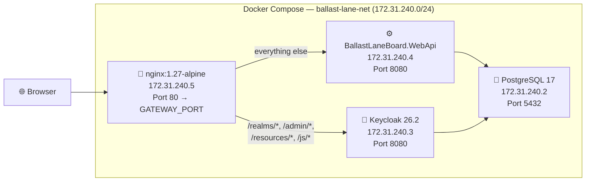

# Docker Compose Deployment

## Overview

Ballast Lane Board uses Docker Compose to orchestrate a multi-container deployment with four services: PostgreSQL, Keycloak, the .NET API (serving the Angular SPA), and Nginx as a reverse proxy. All services communicate over a dedicated bridge network with static IP assignments.

---

## Architecture



---

## Services

| Service | Image | Static IP | Port | Role |
|---|---|---|---|---|
| **db** | `postgres:17-alpine` | 172.31.240.2 | 5432 | PostgreSQL — stores application data and Keycloak data |
| **keycloak** | `quay.io/keycloak/keycloak:26.2` | 172.31.240.3 | 8080 | OpenID Connect identity provider |
| **api** | Built from `src/BallastLaneBoard.WebApi/Dockerfile` | 172.31.240.4 | 8080 | .NET Web API + Angular SPA (from wwwroot) |
| **nginx** | `nginx:1.27-alpine` | 172.31.240.5 | 80 | Reverse proxy — single entry point |

---

## Environment Variables

Create a `.env` file in the repository root:

```env
POSTGRES_PASSWORD=your_postgres_password
KEYCLOAK_DB_PASSWORD=keycloak
KEYCLOAK_ADMIN_PASSWORD=admin
API_ADMIN_PASSWORD=admin
KEYCLOAK_HOSTNAME=localhost:3000
GATEWAY_PORT=3000
```

| Variable | Description | Example |
|---|---|---|
| `POSTGRES_PASSWORD` | PostgreSQL superuser password | `postgres123` |
| `KEYCLOAK_DB_PASSWORD` | Password for the `keycloak` database user | `keycloak` |
| `KEYCLOAK_ADMIN_PASSWORD` | Keycloak admin console password | `admin` |
| `API_ADMIN_PASSWORD` | API's Keycloak admin client password | `admin` |
| `KEYCLOAK_HOSTNAME` | External hostname for Keycloak (browser-facing) | `localhost:3000` |
| `GATEWAY_PORT` | Host port exposed by Nginx | `3000` |

> [!WARNING]
> Never commit the `.env` file to version control.

---

## Step-by-Step Deployment

### 1. Clone the repository

```bash
git clone https://github.com/user/ballast-lane-board.git
cd ballast-lane-board
```

### 2. Create the `.env` file

```bash
cp .env.example .env  # or create manually with the variables above
```

### 3. Start all services

```bash
docker compose up -d
```

### 4. Verify deployment

```bash
docker compose ps
```

All 4 services should show **running** / **healthy** status.

### 5. Access the application

| URL | Service |
|---|---|
| `http://localhost:3000` | Application (SPA + API) |
| `http://localhost:3000/admin` | Keycloak admin console |
| `http://localhost:3000/swagger` | Swagger UI |

---

## Network Topology

All services run on a custom Docker bridge network `ballast-lane-net` with subnet `172.31.240.0/24`:

| Service | Static IP |
|---|---|
| PostgreSQL | 172.31.240.2 |
| Keycloak | 172.31.240.3 |
| API | 172.31.240.4 |
| Nginx | 172.31.240.5 |

**Why static IPs?** Connection strings in environment variables reference IPs directly (e.g., `Host=172.31.240.2`). Static IPs ensure these are predictable across restarts without relying on Docker DNS for all service-to-service communication.

---

## Health Checks

Services start in order, each waiting for its dependencies to be healthy:

### PostgreSQL

```yaml
test: ["CMD-SHELL", "pg_isready -U postgres"]
interval: 5s | timeout: 3s | retries: 5
```

### Keycloak

```yaml
test: ["CMD-SHELL", "bash -c '</dev/tcp/127.0.0.1/8080'"]
interval: 15s | timeout: 5s | retries: 10 | start_period: 60s
```

Keycloak requires ~60 seconds to initialize (realm import, database setup). The `start_period` prevents premature failure.

### Dependency Chain

```
db (starts first, no dependencies)
  └─→ keycloak (waits for db healthy)
       └─→ api (waits for db + keycloak healthy)
            └─→ nginx (waits for api + keycloak)
```

---

## Keycloak Realm Auto-Import

Keycloak starts with `--import-realm`, automatically importing configuration from mounted volumes:

- **Realm config**: `./keycloak/ballast-lane-board-realm.json`
- **Custom themes**: `./keycloak/themes/ballast-lane-board/`

The realm includes:
- Two pre-configured users (`admin`, `testuser`)
- Client configurations for the SPA and API
- Role mappings (Admin, User)

> [!NOTE]
> Realm import only occurs on first startup. Subsequent startups use the persisted realm from the database.

---

## Auto-Migration on Startup

The API runs `DatabaseMigrationHostedService` on startup, which applies pending EF Core migrations to both bounded-context databases:

```csharp
var taskDb = scope.ServiceProvider.GetRequiredService<TaskUoW>();
await taskDb.Database.MigrateAsync(cancellationToken);

var userDb = scope.ServiceProvider.GetRequiredService<UserUoW>();
await userDb.Database.MigrateAsync(cancellationToken);
```

This runs **before** Kestrel starts accepting requests, ensuring the schema is always up to date.

---

## SPA Hosting

In production (Docker), the .NET API serves the Angular SPA directly from `wwwroot/`:

1. The API Dockerfile builds the Angular app and copies output to `wwwroot/`
2. ASP.NET middleware serves static files and falls back to `index.html` for client-side routes
3. No separate frontend container is needed

---

## Nginx Reverse Proxy

Nginx (`nginx/nginx.conf`) is the single entry point, routing traffic based on URL path:

| Pattern | Destination | Purpose |
|---|---|---|
| `/realms/*`, `/resources/*`, `/admin/*`, `/js/*` | `keycloak:8080` | Keycloak login pages, admin console, static assets |
| Everything else | `api:8080` | API endpoints + Angular SPA |

### Proxy Headers

Nginx forwards these headers to backend services:

- `X-Forwarded-For` — Original client IP
- `X-Forwarded-Proto` — Original protocol (http/https)
- `X-Forwarded-Host` — Original Host header
- `X-Forwarded-Port` — Original port

Keycloak uses these via `KC_PROXY_HEADERS=xforwarded` to construct correct redirect URIs.

---

## Troubleshooting

### Containers not starting or crashing

```bash
docker compose logs <service_name>
docker compose logs -f  # follow all logs
```

Common causes: missing `.env` file, port conflicts, insufficient memory.

### Keycloak slow to start

Keycloak needs ~60–90 seconds to initialize. The `start_period: 60s` prevents Docker from marking it as unhealthy prematurely. Check logs:

```bash
docker compose logs keycloak | grep "started"
```

### Database connection refused

The API and Keycloak wait for the PostgreSQL health check. If the database is still initializing:

```bash
docker compose exec db pg_isready -U postgres
```

### CORS errors in the browser

Ensure `KEYCLOAK_HOSTNAME` matches the URL you're accessing in the browser. Keycloak uses this to generate redirect URIs and CORS policies.

### Redirect URI mismatch

If Keycloak rejects login with "Invalid redirect_uri", verify that:
1. `KEYCLOAK_HOSTNAME` matches the browser URL (e.g., `localhost:3000`)
2. The SPA client in the Keycloak realm has the correct redirect URIs
3. Run the Keycloak host sync if you changed the hostname

### Resetting everything

```bash
docker compose down -v  # removes containers AND volumes (database data)
docker compose up -d    # fresh start with realm import and migrations
```
