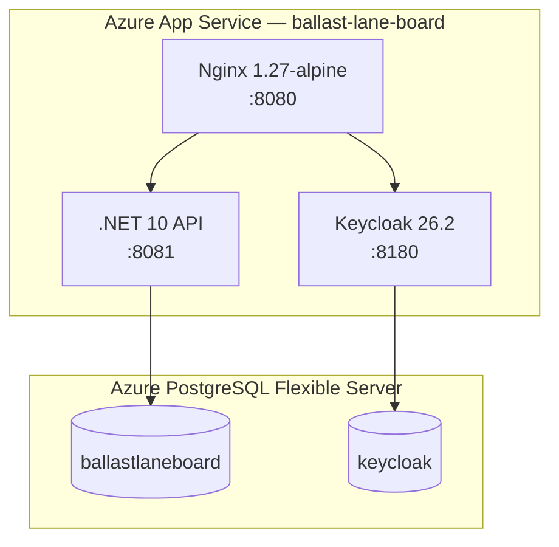

# Current Status

> Last updated: April 2026

## Live Environment

The application is live at **[https://ballast-lane-board.azurewebsites.net](https://ballast-lane-board.azurewebsites.net)**.

| Component | Status | URL |
|---|---|---|
| **Angular SPA** | ✅ Running | [ballast-lane-board.azurewebsites.net](https://ballast-lane-board.azurewebsites.net) |
| **REST API** | ✅ Running | [/health](https://ballast-lane-board.azurewebsites.net/health) |
| **Keycloak OIDC** | ✅ Running | [/realms/ballast-lane-board/.well-known/openid-configuration](https://ballast-lane-board.azurewebsites.net/realms/ballast-lane-board/.well-known/openid-configuration) |
| **Swagger UI** | ✅ Available | [/api](https://ballast-lane-board.azurewebsites.net/api) |

---

## Deployed Services

| Service | Image | Version |
|---|---|---|
| **.NET API** | `clebermargarida/ballast-lane-board` | 1.0.0 |
| **Keycloak** | `clebermargarida/ballast-lane-board-keycloak` | 1.0.0 |
| **Nginx** | `clebermargarida/ballast-lane-board-nginx` | 1.0.0 |

---

## Azure Resources

| Resource | Type | SKU | Region |
|---|---|---|---|
| `ballast-lane-board-rg` | Resource Group | — | West US 2 |
| `ballast-lane-board` | App Service (Linux) | B1 | West US 2 |
| `ballast-lane-board-db` | PostgreSQL Flexible Server | Standard_B1ms | West US 2 |

---

## CI/CD Pipeline

| Job | Trigger | Status |
|---|---|---|
| **Build** | Push to `master`/`develop`, PRs | ✅ Passing |
| **Unit Tests** | Push to `master`/`develop`, PRs | ✅ Passing |
| **Integration Tests** | Push to `master`/`develop`, PRs | ✅ Passing |
| **Publish Docker Images** | GitHub Release | ✅ Operational |
| **Deploy to Azure** | GitHub Release | ✅ Operational |
| **Documentation** | Manual dispatch | ✅ Operational |

---

## Authentication

| Provider | Protocol | Realm |
|---|---|---|
| Keycloak 26.2 | OpenID Connect (PKCE) | `ballast-lane-board` |

### OIDC Clients

| Client ID | Type | Purpose |
|---|---|---|
| `ballast-lane-board-spa` | Public (PKCE) | Angular SPA authentication |
| `ballast-lane-board-api` | Bearer-only | API token validation |

### Demo Accounts

| Username | Password | Roles | Notes |
|---|---|---|---|
| `admin` | `admin` | admin, user | Sees and manages all tasks |
| `testuser` | `password` | user | Sees only own tasks |

> [!NOTE]
> New accounts can be created via the **Sign Up** page at [/signup](https://ballast-lane-board.azurewebsites.net/signup).

---

## Feature Status

| Feature | Status |
|---|---|
| User registration (Keycloak + local DB) | ✅ Working |
| OIDC login / logout (PKCE flow) | ✅ Working |
| Task CRUD (create, read, update, delete) | ✅ Working |
| Task status transitions (Pending → In Progress → Completed) | ✅ Working |
| Role-based access (admin sees all, user sees own) | ✅ Working |
| Kanban board with drag-and-drop | ✅ Working |
| Health endpoint (`/health`) | ✅ Working |
| Swagger UI with bearer token support | ✅ Working |
| Auto-migration on startup | ✅ Working |
| Docker Compose local development | ✅ Working |
| Multi-container Azure deployment | ✅ Working |
| CI/CD with GitHub Actions | ✅ Working |
| DocFX documentation + GitHub Pages | ✅ Working |

---

## Technology Stack

| Layer | Technology | Version |
|---|---|---|
| **Backend** | .NET / ASP.NET Core | 10.0 |
| **Frontend** | Angular + Tailwind CSS | 19 / 4 |
| **Identity** | Keycloak | 26.2 |
| **Database** | PostgreSQL | 17 |
| **Reverse Proxy** | Nginx | 1.27 |
| **Containers** | Docker / Docker Compose | — |
| **Cloud** | Azure App Service + PostgreSQL Flexible Server | — |
| **CI/CD** | GitHub Actions | — |
| **Docs** | DocFX | — |
| **Testing** | xUnit + Testcontainers | — |
